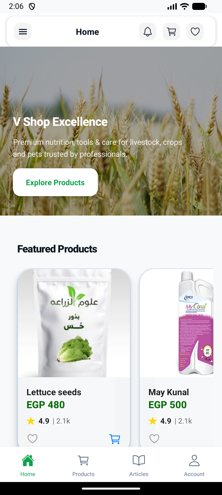
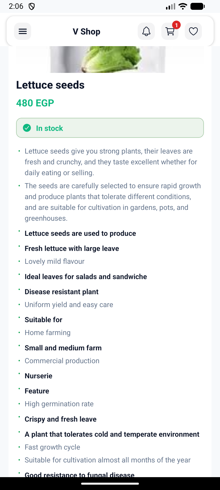
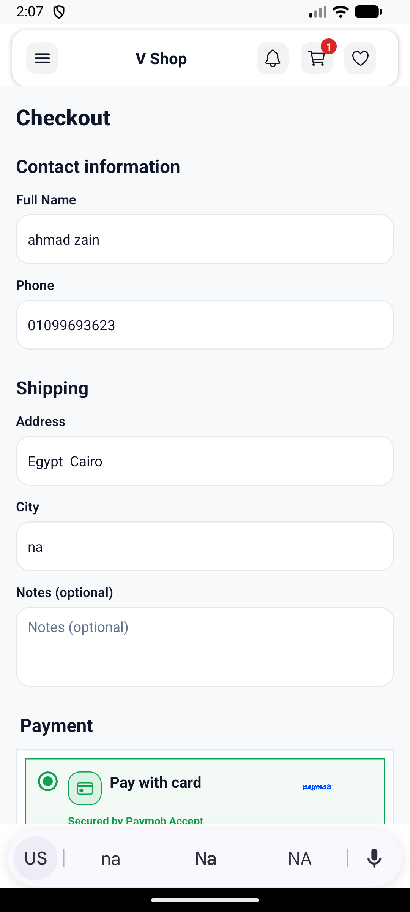
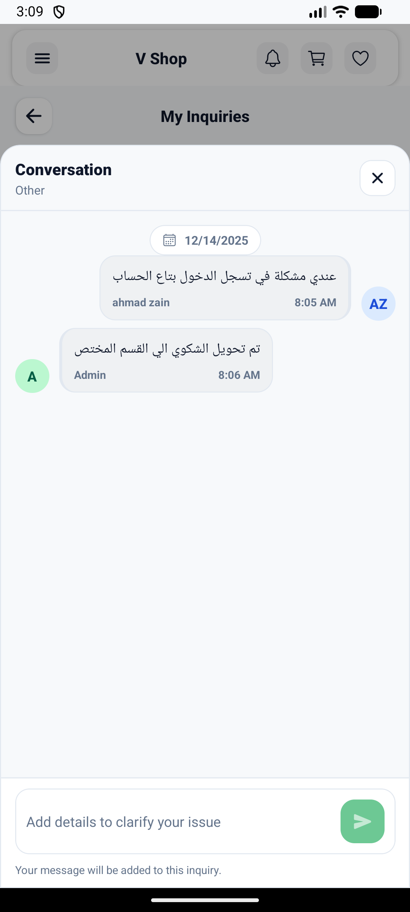
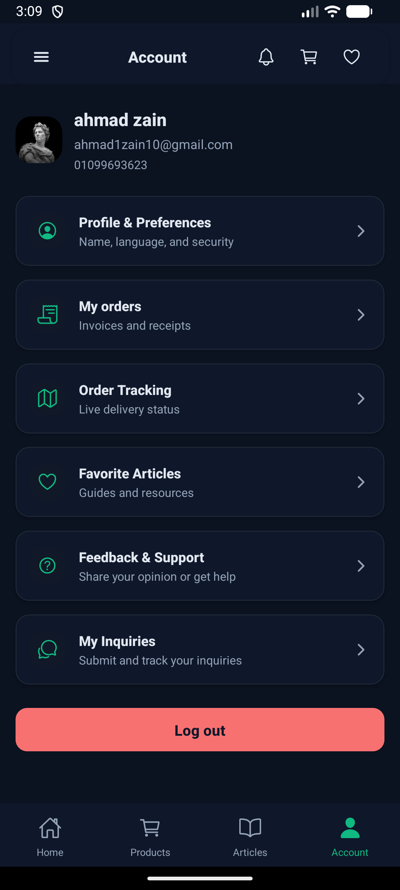
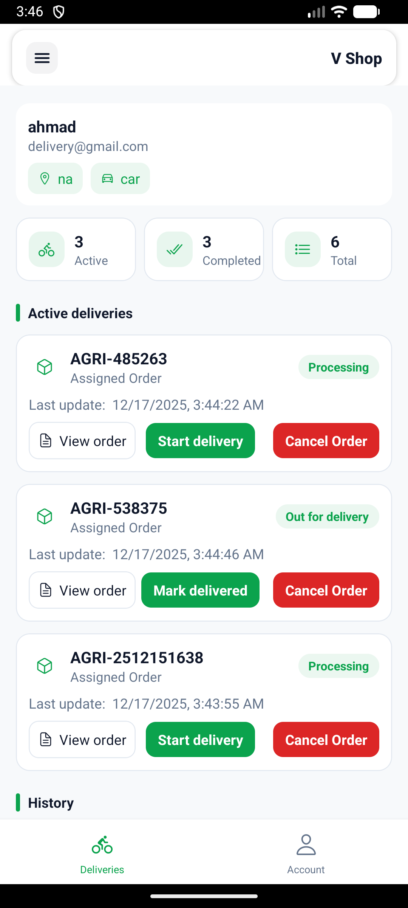

# V Shop

Expo (React Native) app for an agri-vet marketplace featuring shopping, education, and delivery tools in English and Arabic. Web/Vite tooling has been stripped out to stay native-only.

## Demo
- Watch the walkthrough video (streams on GitHub): [V Shop demo

https://github.com/user-attachments/assets/a26f1e2d-175c-4925-9627-70d5b866cfc3

]

## Features
- Auth, profile, and preferences persisted via Firebase Auth/Firestore; light/dark theme and RTL-aware UI.
- Product catalog with search, favorites, cart, and checkout flows (Paymob card iframe, Paymob wallet redirect, PayPal redirect, and cash on delivery). No card vault/saved payment details are stored.
- Orders, invoices, and delivery dashboard for couriers, plus notifications and support/inquiry screens.
- Articles/blog hub with favorites, plus AI shopping assistant and AI product search powered by OpenRouter.
- Navbar/footer, chatbot toggle, and translation support driven by `i18next`.

## Tech Stack
- Expo 51 / React Native 0.74, React Navigation, Redux Toolkit, React Query, Formik/Yup.
- Firebase (Auth, Firestore, Storage) via `src/services/firebase.js`.
- Payments: Paymob (`src/services/paymob.js`) and PayPal (`src/services/paypal.js`).
- AI: OpenRouter/OpenAI (`src/hooks/useAIChat.js`, `src/hooks/useAIProductSearch.js`).
- Localization: `i18next` with `src/i18n/locales/en.json` and `src/i18n/locales/ar.json`.

## Project Structure
- `App.js`, `app.json`, `app.config.js`: Expo entry, runtime config, env binding to `expo.extra`.
- `src/navigation/`: Stack + tab navigators.
- `src/screens/`: Feature pages (auth, home, products, articles, cart, checkout, orders, delivery, support, profile).
- `src/components/`: UI building blocks (layout, checkout/payment, AI chat, etc.).
- `src/features/`: Redux slices (`auth`, `cart`, `favorites`) and async actions.
- `src/services/`: Firebase setup, Paymob/PayPal clients, article/home/user data services.
- `src/theme/`: Theme provider and hooks.
- `src/utils/`: Helpers (env loader, constants, formatting).

## Environment Variables
Set these in a local `.env` (Expo also reads `EXPO_PUBLIC_*` variants via `app.config.js`):
- AI: `EXPO_PUBLIC_OR_KEY`, `EXPO_PUBLIC_OPENAI_KEY`.
- Payments (Paymob): `PAYMOB_API_BASE`, `PAYMOB_API_KEY`, `PAYMOB_IFRAME_ID`, `PAYMOB_CARD_INTEGRATION_ID`, `PAYMOB_WALLET_INTEGRATION_ID`, `PAYMOB_HMAC` (+ `EXPO_PUBLIC_` mirrors).
- Payments (PayPal): `PAYPAL_BASE`, `PAYPAL_CLIENT_ID`, `PAYPAL_SECRET`, `PAYPAL_CURRENCY`, `PAYPAL_EGP_TO_USD_RATE` (+ `EXPO_PUBLIC_` mirrors).
- Firebase: `FIREBASE_API_KEY`, `FIREBASE_AUTH_DOMAIN`, `FIREBASE_PROJECT_ID`, `FIREBASE_STORAGE_BUCKET`, `FIREBASE_MESSAGING_SENDER_ID`, `FIREBASE_APP_ID`, `FIREBASE_MEASUREMENT_ID` (+ `EXPO_PUBLIC_` mirrors).

Keep real secrets out of version control; rotate keys after sharing.

## Running Locally
1) Install Node.js 18+ and Expo CLI (`npm install -g expo-cli` optional).
2) Install dependencies: `npm install`.
3) Add a `.env` with the variables above (Expo reads `EXPO_PUBLIC_*` automatically).
4) Start the app: `npm start` (press `a` for Android emulator/device, `i` for iOS). Use `npm run android` or `npm run ios` directly if you prefer.
5) Clear cache if needed: `npm run clear`.

## Notes
- Branding strings live in `src/i18n/locales/*` and layout components; app display name/slug comes from `app.json`.
- Order assignment/admin for courier dispatch lives in a separate admin project; this repo includes consumer + courier mobile views only.
- Payment providers require valid credentials; sandbox keys are recommended for development. The legacy “fake” card entry flow was removed; only Paymob (card or wallet), PayPal redirect, and COD are active.
- No automated tests are configured; manual validation is recommended after env setup and before releases.
- Copyright: V Shop, all rights reserved. No redistribution, republishing, or reuse is permitted without written approval.

## Screenshots
Mobile highlights

| Home & search | Product details | Checkout & payments |
| --- | --- | --- |
|  |  |  |

| Orders & tracking | Support & AI | Account/profile |
| --- | --- | --- |
|  |  |  |

Ops & admin

| Courier dashboard | Orders (mobile) |
| --- | --- |
|  |  |

More screens
- Full gallery (dark mode, payments, AI helper, auth, courier/admin variants) lives in `SCREENSHOTS.md` with every file under `assets/screenshots/`.
